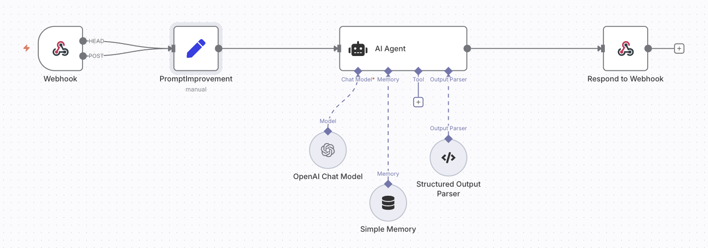

# ✈️ AI-Powered Travel & Expense Assistant

This is a full-stack web application that helps employees plan trips and allows managers to review and approve itineraries and expenses. It combines a React + Tailwind CSS frontend with a Node.js + SQLite backend, and integrates with **n8n** as an AI agent for itinerary generation.

---

## 🎯 Purpose

The goal of this app is to streamline business travel planning by:

- Allowing **employees (travelers)** to generate travel itineraries via an AI chatbot.
- Automatically **extracting structured data** like itineraries and expenses using **n8n AI workflows**.
- Letting **managers** review and approve travel plans through a dedicated dashboard.
- Persisting all data in a lightweight **SQLite database**.

---

## 🧩 Tech Stack

| Layer     | Tech                                        |
| --------- | ------------------------------------------- |
| Frontend  | React, TypeScript, Tailwind CSS             |
| Backend   | Node.js, Express, SQLite3                   |
| AI Engine | [n8n.io](https://n8n.io) (AI Agent Webhook) |
| Database  | SQLite3                                     |

---

## 🚀 Features

### 🔹 Traveler

- Login as employee
- Ask one consolidated question (e.g. trip purpose, destination, number of travelers)
- Submit that input to an n8n webhook
- View the AI-generated itinerary summary
- Save the result to the backend

### 🔹 Manager

- Login as manager
- View a list of travelers and their itineraries/expenses
- Approve each itinerary (if one exists)
- Approved travelers are highlighted and locked for further actions

---

## ⚙️ Setup Instructions

### 🔧 Backend Setup

1. Navigate to the backend folder:

   ```bash
   cd backend
   ```

2. Install dependencies:

   ```bash
   npm install
   ```

3. Start the server:
   ```bash
   npm start
   ```

This starts the SQLite-based API at `http://localhost:4000`.

### 🌐 Frontend Setup

1. Navigate to the frontend root:

   ```bash
   cd frontend
   ```

2. Install dependencies:

   ```bash
   npm install
   ```

3. Start the React app:
   ```bash
   npm start
   ```

The app should now be running at `http://localhost:3000`.

---

## 🔁 n8n Webhook Integration

The chatbot uses an **n8n webhook** to process user input via an OpenAI-based agent. The webhook should:

1. Receive a single message containing:
   ```json
   {
     "message": "Business trip to London for 4 people..."
   }
   ```
2. Extract structured data:

   - `itinerary.summary`: HTML content
   - `expenses`: Array of cost items
   - `nextMessage`: Optional follow-up

3. Respond with a structure like:
   ```json
   {
     "output": {
       "itinerary": { "summary": "<h3>Day 1</h3>..." },
       "expenses": [
         { "description": "Flight", "cost": "£500", ... }
       ],
       "nextMessage": "Let me know if you'd like to make changes."
     }
   }
   ```

---

## 🔐 Hardcoded Users

| Name           | Email                        | Role     | Password    |
| -------------- | ---------------------------- | -------- | ----------- |
| David Ruano    | david.ruano@algoworks.com    | traveler | traveler123 |
| Andres Yajamin | andres.yajamin@algoworks.com | traveler | traveler123 |
| Emily Johnson  | emily.johnson@algoworks.com  | traveler | traveler123 |
| John Smith     | john.smith@algoworks.com     | traveler | traveler123 |
| Nisha Gharpure | nisha.gharpure@algoworks.com | manager  | manager123  |
| Adam Carter    | adam.carter@algoworks.com    | manager  | manager123  |

> You can modify or expand these in `db.js`.

---

## 🧠 AI Workflow (n8n)

Below is a visual representation of the AI workflow in [n8n](https://n8n.io), which handles the trip planning logic.

## 

---

## 🤖 Powered By

- [n8n.io](https://n8n.io) – Workflow automation & AI agents
- [OpenAI](https://openai.com/) – GPT-based natural language understanding
- [Tailwind CSS](https://tailwindcss.com/) – Fast UI styling
- [SQLite](https://sqlite.org/) – Lightweight embedded database

---

## 📬 Questions or Feedback?

Feel free to reach out or fork and contribute. Happy traveling!

---

## 👥 Creators

This project was created by the following team members (also available as default users in the app):

| Name           | Email                        |
| -------------- | ---------------------------- |
| David Ruano    | david.ruano@algoworks.com    |
| Andres Yajamin | andres.yajamin@algoworks.com |
| Nisha Gharpure | nisha.gharpure@algoworks.com |
| Adam Carter    | adam.carter@algoworks.com    |
